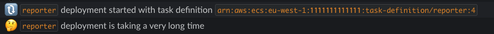

# MONA

Mona is a deployment monitor for ECS services. It will use API periodic calls to know which services are running in the cluster,
and what their deployment status is. It will send the following notification:
- A new deployment was started by a user.
- A scaling event happened, i.e. someone changed the desired count of the service.
- A task crashed and the service is recovering.
- A deployment (/scale/recovery) finished.
- A deployment is going on for more than the defined timeout (since latest update). This might also indicates an error.

### Deployment

Mona should be deployed as a service (e.g. in ECS) and requires read permissions for ECS.

You can add this policy to the role you use to run the service:

```json
{
    "Version": "2012-10-17",
    "Statement": [
        {
            "Effect": "Allow",
            "Action": [
                "ecs:Describe*",
                "ecs:List*"
            ],
            "Resource": "*"
        }
    ]
}
```

### Configurations

Using `mona` requires providing a `messageSender` and an optional `messageFormatter` - see below.

Required configs:
- `ecsCluster`: The cluster to monitor. Currently we don't support multiple clusters.
- `AWSRegion`: The region the cluster is in.

Optional configs:
- `serviceNamesOverride`: If you want to monitor specific service, provide an array of their names in ECS. Currently lists with over 10 items are not supported.
- `secondsUntilAlert`: Time in seconds to wait for a deployment to finish before sending an alert.
- `checkIntervalSeconds`: Interval for checking service statuses.
- `logInterval`: Interval for logging all the service statuses.
- `refreshServicesInterval`: Interval for refreshing the service list.

#### messageSender
Should support the api `send: message => {}`. See example for slack

#### messageFormatter
Provide a message formatter if you want to override the defaults.

You can partially override it by only implementing some functions. The options are

```js
const messageFormatter = {
  deploy: serviceState => '',
  scale: serviceState => '',
  recover: serviceState => '',
  deployDone: serviceState => '',
  deployTimeout: serviceState => '',
  monitorDeploy: (serviceNames, cluster) => '' // sent when mona starts
}
```
the serviceState includes:
- `deploymentId` - The primary deploymentId in ECS. Changes every time a user updates the service).
- `deploymentCreated` - The time of the last update to the primary deployment.
- `success` - true ifff desiredCount === runningCount in the primary deployment,
- `taskDef` - ARN of the task definition in the primary deployment,
- `runningCount`
- `desiredCount`

### Examples from slack bot

##### Successful deployment

##### Recover from error

##### Scaling event

##### Deployment timeout

