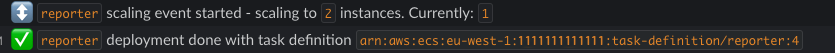

# MONA

Mona is a deployment monitor for ECS services. It will use API periodic calls to know which services are running in the cluster,
and what their deployment status is. It will send the following notification:
- A new deployment was started by a user.
- A scaling event happened. This either means someone changed the desired count of the service, or a task failed.
- A deployment finished.
- A deployment is going on for more than the defined timeout (since latest update). This might also indicates an error.

### Configurations

Using `mona` requires providing a `messageSender` and an optional `messageFormatter` - see below.

Required configs:
- ecsCluster: The cluster to monitor. Currently we don't support multiple clusters.

Optional configs:
- serviceNamesOverride: If you want to monitor specific service, provide an array of their names in ECS. Currently lists with over 10 items are not supported.
- secondsUntilAlert: Time in seconds to wait for a deployment to finish before sending an alert.
- checkIntervalSeconds: Interval for checking service statuses.
- logInterval: Interval for logging all the service statuses.
- refreshServicesInterval: Interval for refreshing the service list.

#### messageSender
Should support the api `send: message => {}`. See example for slack

#### messageFormatter
Provide a message formatter if you want to override the defaults.

You can partially override it by only implementing some functions. The options are

```js
const messageFormatter = {
  deploy: serviceState => '',
  scale: serviceState => '',
  deployDone: serviceState => '',
  deployTimeout: serviceState => '',
  monitorDeploy: (serviceNames, cluster) => '' // sent when mona starts
}
```

The default formatter will use a different message when calling `scale` depending on the number of running tasks. When it's 0,
it likely means there was an error in a running task.
This will send a false error if the service was configured to have 0 running tasks before, and it was increased.

the serviceState includes:
- deploymentId - The primary deploymentId in ECS. Changes every time a user updates the service).
- deploymentCreated - The time of the last update to the primary deployment.
- success - true ifff desiredCount === runningCount in the primary deployment,
- taskDef - ARN of the task definition in the primary deployment,
- runningCount
- desiredCount

### Examples from slack bot

##### Successful deployment

##### Deployment re-started

##### Scaling event

##### Deployment timeout

